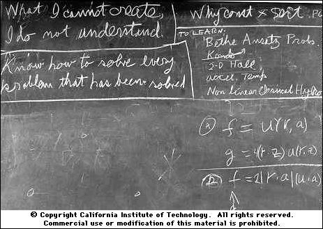

# Single Cell Genomics Library Structure
Collections of library structure and sequence of popular single cell genomic methods (mainly scRNA-seq).

## How to use?

Click the following links to veiw the methods. Notes:

1. The default alignment font is Monaco. Courier New font will be used if Monaco is not available.
2. Index1 (i7) is always sequenced using the bottom strand as template, regardless of the Illumina machine in use. That is why the index sequences are reverse complementary to the primer sequences.
3. In a dual-index library, how index2 (i5) is sequenced differs from machines to machines. According to the [Index Sequencing Guide](data/indexed-sequencing-overview-guide-15057455-05.pdf) from Illumina, Miseq, Hiseq2000/2500 and NovaSeq 6000 use the bottom strand as template, which is why the index sequences are the same as the primer sequences in those machines. iSeq 100, MiniSeq, NextSeq, HiSeq X and HiSeq 3000/4000 use the top strand as template, which is why the index sequences are reverse-complementary to the primer sequences in those machines. All methods listed below use Miseq, Hiseq2000/2500 and NovaSeq as examples.

- ### Gene expression

  - [SMART-seq family (including SMART-seq, SMART-seq2 and SMART-seq3)](https://teichlab.github.io/scg_lib_structs/methods_html/SMART-seq_family.html)
  - [STRT-seq family (including STRT-seq, STRT-seq-C1 and STRT-seq-2i)](https://teichlab.github.io/scg_lib_structs/methods_html/STRT-seq_family.html)
  - [Quartz-seq family (including Quartz-seq and Quartz-seq2)](https://teichlab.github.io/scg_lib_structs/methods_html/Quartz-seq_family.html)
  - [CEL-seq family (including CEL-seq and CEL-seq2)](https://teichlab.github.io/scg_lib_structs/methods_html/CEL-seq_family.html)
  - [10x Chromium Single Cell 3' V3 FeatureBarcoding](https://teichlab.github.io/scg_lib_structs/methods_html/10xChromium3fb.html)
  - [10x Chromium Single Cell 3' V2 and V3 GE](https://teichlab.github.io/scg_lib_structs/methods_html/10xChromium3.html)
  - [10x Chromium Single Cell 3' V1 GE](https://teichlab.github.io/scg_lib_structs/methods_html/10xChromium3v1.html)
  - [10x Chromium Single Cell 5' GE](https://teichlab.github.io/scg_lib_structs/methods_html/10xChromium5.html)
  - [SureCell 3' WTA for ddSEQ](https://teichlab.github.io/scg_lib_structs/methods_html/SureCell.html)
  - [MARS-seq / MARS-seq2.0](https://teichlab.github.io/scg_lib_structs/methods_html/MARS-seq.html)
  - [SCRB-seq / mcSCRB-seq](https://teichlab.github.io/scg_lib_structs/methods_html/SCRB-seq.html)
  - [Drop-seq / Seq-Well](https://teichlab.github.io/scg_lib_structs/methods_html/Drop-seq.html)
  - [scifi-RNA-seq](https://teichlab.github.io/scg_lib_structs/methods_html/scifi-RNA-seq.html)
  - [Microwell-seq](https://teichlab.github.io/scg_lib_structs/methods_html/Microwell-seq.html)
  - [BD Rhapsody](https://teichlab.github.io/scg_lib_structs/methods_html/BD_Rhapsody.html)
  - [sci-RNA-seq3](https://teichlab.github.io/scg_lib_structs/methods_html/sci-RNA-seq3.html)
  - [sci-RNA-seq](https://teichlab.github.io/scg_lib_structs/methods_html/sci-RNA-seq.html)
  - [SPLiT-seq](https://teichlab.github.io/scg_lib_structs/methods_html/SPLiT-seq.html)
  - [inDrop](https://teichlab.github.io/scg_lib_structs/methods_html/inDrop.html)

- ### Chromatin accessibility and protein-DNA interactions

  - [10x Chromium Single Cell ATAC](https://teichlab.github.io/scg_lib_structs/methods_html/10xChromium_scATAC.html)
  - [dscATAC-seq/dsciATAC-seq](https://teichlab.github.io/scg_lib_structs/methods_html/dscATAC.html)
  - [sci-ATAC-seq](https://teichlab.github.io/scg_lib_structs/methods_html/sci-ATAC-seq.html)
  - [snATAC-seq](https://teichlab.github.io/scg_lib_structs/methods_html/snATAC-seq.html)
  - [scTHS-seq](https://teichlab.github.io/scg_lib_structs/methods_html/scTHS-seq.html)
  - [itChIP-seq](https://teichlab.github.io/scg_lib_structs/methods_html/itChIP-seq.html)
  - [Drop-ChIP](https://teichlab.github.io/scg_lib_structs/methods_html/Drop-ChIP.html)
  - [CoBATCH](https://teichlab.github.io/scg_lib_structs/methods_html/CoBATCH.html)

- ### Genomic DNA and DNA methylation

  - in progress

- ### Multi-Omics

  - in progress

## Technical comparisons (scRNA-seq only)

**The basic chemistry is very similar, the main differences among those scRNA-seq methods are summarised in the table below. For a detailed discussion, check the text boxes from our review: [From Tissues to Cell Types and Back: Single-Cell Gene Expression Analysis of Tissue Architecture](https://www.annualreviews.org/doi/10.1146/annurev-biodatasci-080917-013452)**

|                                  | Single cell isolation/capture |     Where RT happens     |         2nd strand synthesis        | Full-length cDNA synthesis |                      Barcode addition                     | Pooling before library |  Library amplification | Gene coverage |
|:--------------------------------:|:-----------------------------:|:------------------------:|:-----------------------------------:|:--------------------------:|:---------------------------------------------------------:|:----------------------:|:----------------------:|:-------------:|
|    10x Chromium Single Cell 3'   |            Droplet            |        In droplets       |                 TSO                 |             Yes            |                    Barcoded RT primers                    |           Yes          |           PCR          |       3'      |
|    10x Chromium Single Cell 5'   |            Droplet            |        In droplets       |                 TSO                 |             Yes            |                    Barcoded TSO primers                   |           Yes          |           PCR          |       5'      |
|            BD Rhapsody           |           Nanowells           |    In collection tubes   | Random priming and primer extension |             No             |                    Barcoded RT primers                    |           Yes          |           PCR          |       3'      |
|         CEL-seq/CEL-seq2         |              FACS             |     In 96w/384w wells    |        RNase H and DNA pol I        |             No             |                    Barcoded RT primers                    |           Yes          | In vitro transcription |       3'      |
|             Drop-seq             |            Droplet            |    In collection tubes   |                 TSO                 |             Yes            |                    Barcoded RT primers                    |           Yes          |           PCR          |       3'      |
| Illumina Bio-Rad SureCell 3' WTA |            Droplet            |        In droplets       |        RNase H and DNA pol I        |             No             |                    Barcoded RT primers                    |           Yes          |           PCR          |       3'      |
|              inDrop              |            Droplet            |        In droplets       |        RNase H and DNA pol I        |             No             |                    Barcoded RT primers                    |           Yes          | In vitro transcription |       3'      |
|       MARS-seq/MARS-seq2.0       |              FACS             |     In 96w/384w wells    |        RNase H and DNA pol I        |             No             |                    Barcoded RT primers                    |           Yes          | In vitro transcription |       3'      |
|           Microwell-seq          |           Nanowells           |    In collection tubes   |                 TSO                 |             Yes            |                    Barcoded RT primers                    |           Yes          |           PCR          |       3'      |
|            Quartz-seq            |              FACS             |     In 96w/384w wells    |  PolyA tailing and primer ligation  |             Yes            |            Ligation of barcoded Truseq adapters           |           No           |           PCR          |       3'      |
|            Quartz-seq2           |              FACS             |     In 96w/384w wells    |  PolyA tailing and primer ligation  |             Yes            |                    Barcoded RT primers                    |           Yes          |           PCR          |       3'      |
|            sci-RNA-seq           |           Not needed          |          In situ         |        RNase H and DNA pol I        |             No             | Barcoded RT primers and library PCR with barcoded primers |           Yes          |           PCR          |       3'      |
|           sci-RNA-seq3           |           Not needed          |          In situ         |        RNase H and DNA pol I        |             No             |          Barcoded RT primers and hairpin adapters         |           Yes          |           PCR          |       3'      |
|           scifi-RNA-seq          |     Droplet multiple cells    |          In situ         |                 TSO                 |             Yes            |         Barcoded RT primers and gel bead barcodes         |           Yes          |           PCR          |       3'      |
|        SCRB-seq/mcSCRB-seq       |              FACS             |     In 96w/384w wells    |                 TSO                 |             Yes            |                    Barcoded RT primers                    |           Yes          |           PCR          |       3'      |
|             Seq-Well             |           Nanowells           |    In collection tubes   |                 TSO                 |             Yes            |                    Barcoded RT primers                    |           Yes          |           PCR          |       3'      |
|  SMART-seq/SMART-seq2/SMART-seq3 |      FACS or Fluidigm C1      |     In 96w/384w wells    |                 TSO                 |             Yes            |             Library PCR with barcoded primers             |           No           |           PCR          |  full-length  |
|             SPLiT-seq            |           Not needed          |          In situ         |                 TSO                 |             Yes            |              Ligation of barcoded RT primers              |           Yes          |           PCR          |       3'      |
|             STRT-seq             |              FACS             |     In 96w/384w wells    |                 TSO                 |             Yes            |                    Barcoded TSO primers                   |           Yes          |           PCR          |       5'      |
|            STRT-seq-C1           |          Fluidigm C1          | In microfluidic chambers |                 TSO                 |             Yes            |                  Barcoded Tn5 transposase                 |           No           |           PCR          |       5'      |
|            STRT-seq-2i           |        FACS or dilution       |      In 9600w wells      |                 TSO                 |             Yes            |          Barcoded PCR primers and Tn5 transposase         |           Yes          |           PCR          |       5'      |

## Motivation

I was a little bit bombarded with all the single cell methods and got completely lost. To help myself understand all of them and future troubleshooting, I start to perform an on-paper library preparation whenever I see a new single cell method.

## Why bother?

Here I borrow from Feyman:

**What I cannot create, I do not understand.**

----

## TODO:

- [Trac-looping](https://www.nature.com/articles/s41592-018-0107-y)
- [MATQ-seq](https://www.nature.com/articles/nmeth.4145)
- [scDam&T-seq](https://www.nature.com/articles/s41587-019-0150-y)
- [SNARE-seq](https://www.nature.com/articles/s41587-019-0290-0)
- [ASTAR-seq](https://www.biorxiv.org/content/10.1101/829960v1)
- [Paired-seq](https://www.nature.com/articles/s41594-019-0323-x)
- [Drop scChIP-seq](https://www.nature.com/articles/s41588-019-0424-9)
- [sci-Plex](https://science.sciencemag.org/content/early/2019/12/04/science.aax6234.full)
- [snmC2T-seq](https://www.biorxiv.org/content/10.1101/2019.12.11.873398v1)
- [MALBAC-DT](https://www.biorxiv.org/content/10.1101/2019.12.31.892190v1)
- [GRID-seq](https://www.nature.com/articles/nbt.3968)
- [ZipSeq](https://www.biorxiv.org/content/10.1101/2020.02.04.932988v1)
- [PETRI-seq](https://www.biorxiv.org/content/10.1101/866244v1)
- [microSPLiT](https://www.biorxiv.org/content/10.1101/869248v2)
- [Seq-Well S^3](https://www.biorxiv.org/content/10.1101/689273v1)

## Feedback

I would be very happy if you go through them and let me know what you think. If you spot some errors/mistakes, or I've missed some key methods. Feel free to contact me:

Xi Chen  
chenx9@sustech.edu.cn
